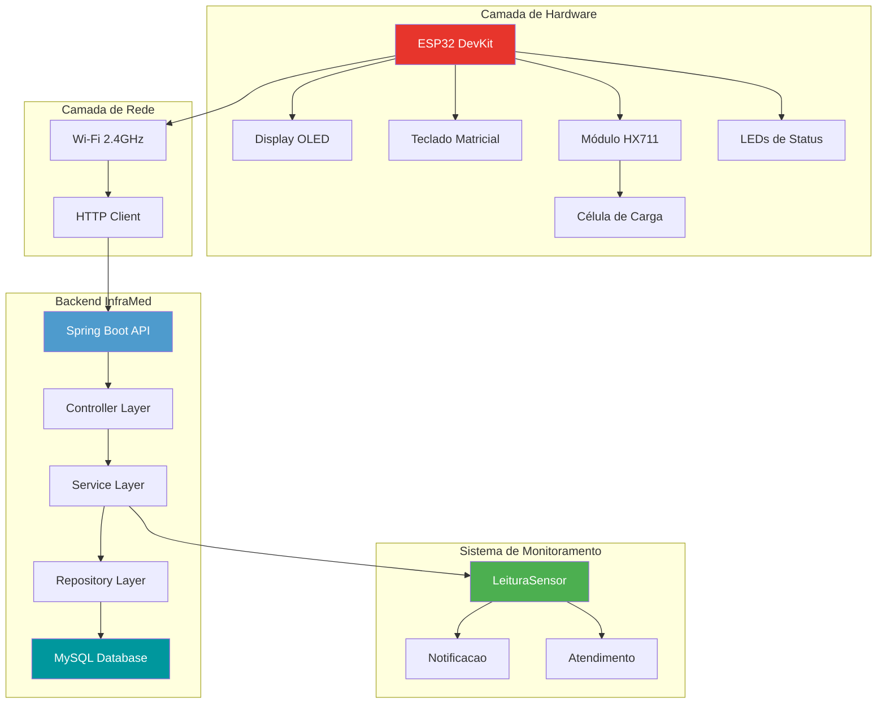
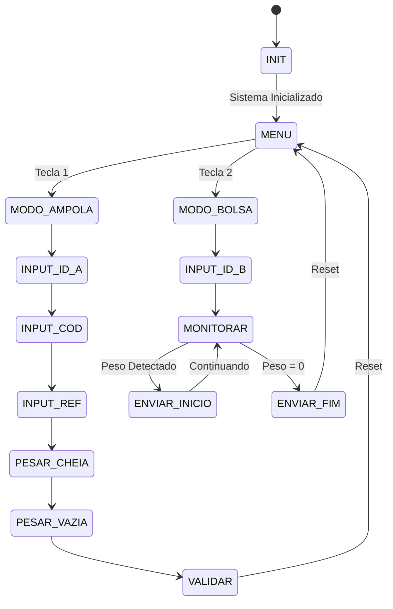
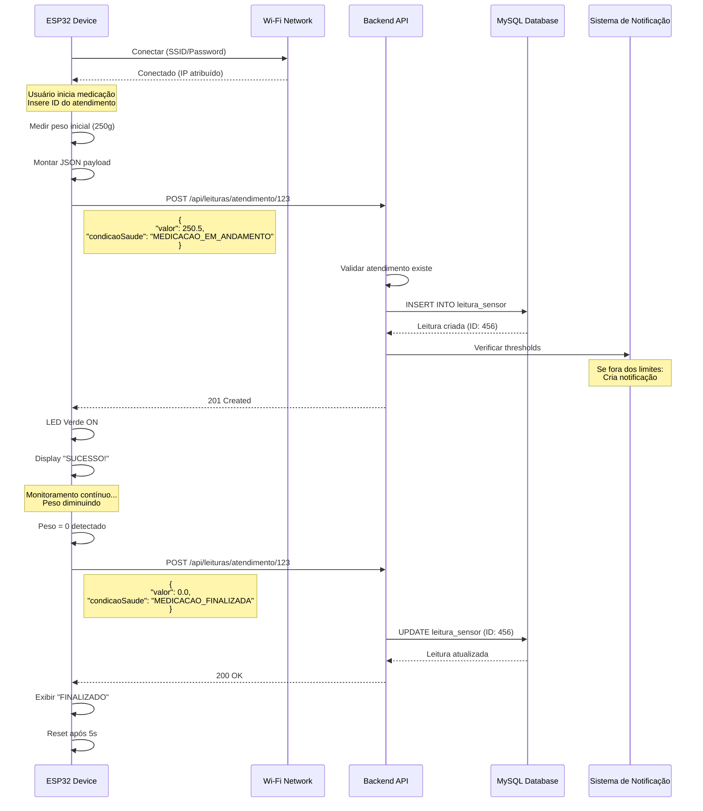
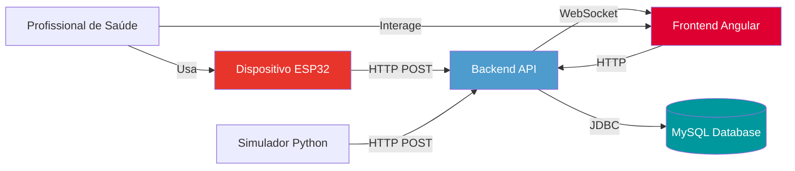

# InfraMed IOT - Dispositivo de Monitoramento de Medicação

**Dispositivo IoT baseado em ESP32 para pesagem e registro de medicações, integrado em tempo real com a API de monitoramento de pacientes InfraMed.**

---

<p align="center">
  
  
  
  
</p>

---

## 📋 Sumário

- [📖 Sobre o Projeto](#-sobre-o-projeto)
- [✨ Principais Funcionalidades](#-principais-funcionalidades)
- [🏗️ Arquitetura do Sistema](#-arquitetura-do-sistema)
- [⚙️ Hardware Utilizado](#-hardware-utilizado)
- [🛠️ Bibliotecas e Tecnologias](#-bibliotecas-e-tecnologias)
- [🔄 Fluxo de Funcionamento](#-fluxo-de-funcionamento)
- [🔌 Integração com API Backend](#-integração-com-api-backend)
- [🚀 Como Executar](#-como-executar)
- [⚡ Troubleshooting](#-troubleshooting)
- [🧪 Testes e Qualidade](#-testes-e-qualidade)
- [🌐 Ecossistema Completo](#-ecossistema-completo)
- [💡 Contexto do Projeto](#-contexto-do-projeto)
- [✍️ Autor](#-autor)

---

## 📖 Sobre o Projeto

O **InfraMed IoT** é o componente de hardware do ecossistema InfraMed, materializando a ponte entre o mundo físico e o sistema de gestão hospitalar. Este projeto consiste em um dispositivo embarcado, construído com um microcontrolador **ESP32**, projetado para automatizar e garantir a precisão no processo de administração de medicamentos.

O dispositivo guia o profissional de saúde através de um fluxo simples e intuitivo para registrar a pesagem de medicamentos, associando-a diretamente a um atendimento específico. Os dados coletados são enviados via Wi-Fi para o backend [InfraMed](https://github.com/matheus05dev/BackendMonitoramentoPacientes), garantindo que as informações estejam sempre atualizadas e centralizadas, reduzindo erros manuais e otimizando o tempo da equipe.

### 🎯 Objetivos

- Automatizar o processo de registro de administração de medicamentos
- Garantir precisão nas dosagens através de pesagem eletrônica
- Integrar dados em tempo real com o sistema hospitalar
- Reduzir erros de medicação e melhorar a segurança do paciente
- Fornecer rastreabilidade completa do processo de medicação

---

## ✨ Principais Funcionalidades

### Interface e Controle
- **Interface de Usuário Intuitiva:** Display OLED e teclado matricial para navegação simples
- **Máquina de Estados Robusta:** Fluxo controlado que previne erros de operação
- **Feedback Visual Multi-canal:** LEDs de status e mensagens no display para comunicação clara

### Capacidades de Medição
- **Pesagem de Precisão:** Sensor de célula de carga com módulo HX711 para medições precisas
- **Dois Modos de Operação:**
  - **Modo Ampola:** Validação de dose dispensada por diferença de peso
  - **Modo Bolsa:** Monitoramento contínuo de infusão com detecção automática

### Conectividade e Integração
- **Conectividade Wi-Fi:** Comunicação direta com servidor backend
- **Integração REST API:** Envio automático via HTTP POST
- **Sincronização em Tempo Real:** Status de medicação atualizado instantaneamente
- **Sistema Público de Acesso:** Endpoints IoT sem necessidade de autenticação para facilitar integração

### Funcionalidades Operacionais
- **Tara Automática:** Função de zeragem da balança
- **Validação de Dose:** Comparação automática com valor de referência
- **Detecção de Finalização:** Identificação automática de término de medicação
- **Reset Inteligente:** Reinício rápido do processo quando necessário

---

## 🏗️ Arquitetura do Sistema



### Componentes da Arquitetura

#### Camada de Hardware (ESP32)
- **Microcontrolador:** ESP32 com Wi-Fi integrado
- **Sensores:** Célula de carga + HX711 para medição precisa
- **Interface:** Display OLED + Teclado matricial + LEDs
- **Comunicação:** Wi-Fi 802.11 b/g/n (2.4GHz)

#### Camada de Aplicação
- **Framework:** Arduino para ESP32
- **Protocolo:** HTTP/REST
- **Formato de Dados:** JSON
- **Serialização:** ArduinoJson library

#### Camada Backend
- **Framework:** Spring Boot 3.4.5
- **Banco de Dados:** MySQL 8.0
- **Segurança:** JWT (endpoints IoT públicos)
- **API:** RESTful com Swagger documentation

---

## ⚙️ Hardware Utilizado

| Componente                | Descrição                                                   | Pinos (ESP32)                                       |
| ------------------------- | ----------------------------------------------------------- | --------------------------------------------------- |
| **ESP32 DevKit**          | Microcontrolador principal com Wi-Fi integrado              | -                                                   |
| **Display OLED SSD1306**  | Tela de 128x64 pixels para interface (I2C)                  | `SDA (21)`, `SCL (22)`                              |
| **Módulo HX711**          | Amplificador de 24-bit para célula de carga                 | `DOUT (15)`, `CLK (2)`                              |
| **Célula de Carga**       | Sensor strain gauge para medição de peso                    | Conectada ao HX711                                  |
| **Teclado Matricial 4x3** | Interface de entrada de dados numéricos                     | Linhas: `27, 26, 25, 33` <br> Colunas: `13, 12, 14` |
| **LED Verde**             | Indicador de sucesso/operação normal                        | `18`                                                |
| **LED Vermelho**          | Indicador de erro/aguardando                                | `19`                                                |

### Diagrama de Conexões

```
ESP32 DevKit
├── I2C Bus (Display OLED)
│   ├── SDA → GPIO 21
│   └── SCL → GPIO 22
├── HX711 (Balança)
│   ├── DOUT → GPIO 15
│   └── CLK → GPIO 2
├── Teclado 4x3
│   ├── Linhas → GPIO 27, 26, 25, 33
│   └── Colunas → GPIO 13, 12, 14
└── LEDs
    ├── Verde → GPIO 18
    └── Vermelho → GPIO 19
```

---

## 🛠️ Bibliotecas e Tecnologias

### Ambiente de Desenvolvimento
- **PlatformIO:** Ambiente de desenvolvimento profissional para sistemas embarcados
- **Arduino Framework:** Base para desenvolvimento simplificado no ESP32
- **Platform:** Espressif32

### Bibliotecas Principais

| Biblioteca | Versão | Função |
|-----------|---------|---------|
| `ArduinoJson` | ^7.4.2 | Serialização/deserialização de dados JSON para API |
| `Adafruit GFX Library` | ^1.12.4 | Biblioteca gráfica base para display |
| `Adafruit SSD1306` | ^2.5.15 | Driver específico para display OLED |
| `HX711` | ^0.7.5 | Interface com módulo amplificador da balança |
| `Keypad` | ^3.1.1 | Leitura de teclado matricial |
| `WiFi.h` | Built-in | Conectividade Wi-Fi do ESP32 |
| `HTTPClient.h` | Built-in | Cliente HTTP para requisições REST |

### Configuração do PlatformIO

```ini
[env:esp32dev]
platform = espressif32
board = esp32dev
framework = arduino
monitor_speed = 115200
lib_deps = 
    bblanchon/ArduinoJson@^7.4.2
    adafruit/Adafruit GFX Library@^1.12.4
    adafruit/Adafruit SSD1306@^2.5.15
    bogde/HX711@^0.7.5
    chris--a/Keypad@^3.1.1
```

---

## 🔄 Fluxo de Funcionamento

### Diagrama de Estados



### Menu Principal

Ao inicializar, o sistema apresenta um menu para seleção do modo de operação:

- **Opção 1:** Modo Ampola (Medição Precisa)
- **Opção 2:** Modo Bolsa (Monitoramento Contínuo)

---

### 💉 Modo 1: Medição de Ampola (Dispensação Precisa)

Este modo valida se a quantidade de medicamento dispensado corresponde ao valor de referência.

#### Fluxo de Operação

**ETAPA P1: Inserir ID do Atendimento**
- Digite o ID do atendimento e pressione `#` para confirmar
- Use `*` para corrigir dígitos

**ETAPA P2: Inserir Código da Medicação**
- Digite o código da medicação e pressione `#`
- Máximo de 8 dígitos

**ETAPA P3: Inserir Peso de Referência**
- Digite o peso esperado em gramas
- Use `*` para inserir ponto decimal
- Pressione `#` para confirmar

**ETAPA P4: Pesar Ampola Cheia**
- Coloque a ampola cheia na balança
- Aguarde estabilização do peso
- Pressione `#` para capturar
- Use `*` para tarar se necessário

**ETAPA P5: Pesar Ampola Vazia**
- Dispense o medicamento
- Coloque a ampola vazia na balança
- Pressione `#` para capturar

**ETAPA P6: Validação**
- Sistema calcula: `Peso Dispensado = Peso Cheia - Peso Vazia`
- Compara com peso de referência (tolerância: ±0.5g)
- Exibe resultado:
  - ✅ **CORRETO** (LED Verde): Dentro da tolerância
  - ❌ **ERRO** (LED Vermelho): Fora da tolerância
- Pressione `1` para reiniciar

> **Nota:** Nesta versão, o envio de dados ao servidor para este modo é simulado localmente.

---

### 💧 Modo 2: Monitoramento de Bolsa de Soro (Infusão Contínua)

Este modo monitora continuamente o peso de uma bolsa de medicação e reporta o status automaticamente ao backend.

#### Fluxo de Operação

**ETAPA T1: Inserir ID do Atendimento**
- Digite o ID do atendimento e pressione `#`
- O ID deve corresponder a um atendimento válido no sistema

**ETAPA T2: Iniciar Monitoramento**
- Coloque a bolsa de medicação na balança
- Sistema detecta peso inicial automaticamente

**ETAPA T3: Monitoramento Automático**

O sistema entra em modo de monitoramento contínuo:

1. **Detecção de Início:**
   - Peso detectado pela primeira vez
   - Envia status `MEDICACAO_EM_ANDAMENTO` para API
   - LED verde aceso
   - Cria registro de leitura no banco de dados

2. **Monitoramento Contínuo:**
   - Atualização de peso a cada 50ms
   - Display mostra peso atual em tempo real
   - Sistema aguarda esvaziamento da bolsa

3. **Detecção de Fim:**
   - Peso da bolsa ≤ 0g
   - Envia status `MEDICACAO_FINALIZADA` para API
   - Atualiza registro no banco de dados
   - Exibe mensagem de sucesso
   - Sistema reinicia automaticamente após 5s

**Controles Disponíveis:**
- Pressione `1` a qualquer momento para reiniciar o processo

---

## 🔌 Integração com API Backend

### Visão Geral da Integração

O dispositivo ESP32 se comunica com o backend InfraMed através de requisições HTTP POST, enviando dados de leitura de sensores que são armazenados e processados pelo sistema de gerenciamento hospitalar.

### Configuração de Conexão

```cpp
// Configurações Wi-Fi
const char *ssid = "Senai-IoT";              // Nome da rede
const char *password = "senaiiot";            // Senha da rede

// Configurações do Servidor
const char *serverBaseUrl = "http://192.168.1.14:8080/api/leituras/atendimento/";
```

> **⚠️ Importante:** Ajuste o IP e porta conforme a configuração do seu servidor backend.

---

### Endpoint Utilizado

#### POST - Criar Leitura de Sensor

**URL:** `POST /api/leituras/atendimento/{atendimentoId}`

**Permissão:** `PUBLIC` (sem necessidade de autenticação)

**Descrição:** Cria uma nova leitura de sensor associada a um atendimento específico. Este endpoint é público para facilitar a integração com dispositivos IoT.

**Path Parameter:**
- `atendimentoId` (Long) - ID do atendimento ao qual a leitura será vinculada

---

### Formato do Payload JSON

```json
{
  "valor": 250.5,
  "tipoDado": "MEDICACAO",
  "unidadeMedida": "GRAMAS",
  "condicaoSaude": "MEDICACAO_EM_ANDAMENTO",
  "codigo": 12,
  "atendimentoId": 123
}
```

### Campos do Payload

| Campo | Tipo | Obrigatório | Descrição | Valores Possíveis |
|-------|------|-------------|-----------|-------------------|
| `valor` | float | ✅ | Peso medido pela balança em gramas | Qualquer valor numérico positivo |
| `tipoDado` | string | ✅ | Tipo do dado sendo enviado | `"MEDICACAO"` (fixo) |
| `unidadeMedida` | string | ✅ | Unidade de medida do valor | `"GRAMAS"` (fixo) |
| `condicaoSaude` | string | ✅ | Status atual da medicação | `"MEDICACAO_EM_ANDAMENTO"` ou `"MEDICACAO_FINALIZADA"` |
| `codigo` | int | ✅ | Código identificador do dispositivo | `12` (fixo no código) |
| `atendimentoId` | int | ✅ | ID do atendimento informado pelo usuário | Deve existir no sistema |

### Estados de Condição de Saúde

| Status | Quando é Enviado | Ação no Sistema |
|--------|------------------|-----------------|
| `MEDICACAO_EM_ANDAMENTO` | Quando peso inicial é detectado na balança | Cria novo registro de leitura e pode gerar notificação |
| `MEDICACAO_FINALIZADA` | Quando peso da bolsa chega a zero | Atualiza registro existente e finaliza o monitoramento |

---

### Códigos de Resposta HTTP

| Código | Status | Significado | Ação do Dispositivo |
|--------|--------|-------------|---------------------|
| `200` | OK | Leitura registrada com sucesso | LED verde aceso, continua operação |
| `201` | Created | Novo registro criado | LED verde aceso, continua operação |
| `400` | Bad Request | Dados inválidos no payload | Display mostra erro, solicita reinício |
| `404` | Not Found | Atendimento não encontrado | Display mostra erro, solicita ID válido |
| `500` | Internal Server Error | Erro no servidor | Display mostra falha, tenta reenviar |
| `-1` | Connection Refused | Servidor não responde | Verifica conexão de rede |
| `-2` | Timeout | Tempo de resposta excedido | Verifica latência da rede |

---

### Implementação no Código

```cpp
void sendReadingToServer(String condicaoSaude)
{
  // Verifica conexão Wi-Fi
  if (WiFi.status() != WL_CONNECTED) {
    Serial.println("ERRO: Wi-Fi desconectado");
    displayWifiStatus("Wi-Fi OFF");
    return;
  }

  // Monta o payload JSON
  StaticJsonDocument<256> doc;
  doc["valor"] = pesoBolsaSoro;              // Peso medido
  doc["tipoDado"] = "MEDICACAO";             // Tipo fixo
  doc["unidadeMedida"] = "GRAMAS";           // Unidade fixa
  doc["condicaoSaude"] = condicaoSaude;      // Status dinâmico
  doc["codigo"] = 12;                        // Código do dispositivo
  doc["atendimentoId"] = inputAtendimentoId.toInt(); // ID do usuário

  String jsonPayload;
  serializeJson(doc, jsonPayload);

  // Constrói URL completa
  String fullUrl = String(serverBaseUrl) + inputAtendimentoId;

  // Configura e envia requisição HTTP
  HTTPClient http;
  http.begin(fullUrl);
  http.addHeader("Content-Type", "application/json");
  
  Serial.println("Enviando POST para: " + fullUrl);
  Serial.println("Payload: " + jsonPayload);

  int httpCode = http.POST(jsonPayload);

  // Trata resposta
  display.clearDisplay();
  display.setTextSize(1);
  display.setCursor(0, 0);

  if (httpCode > 0) {
    Serial.printf("HTTP POST... codigo: %d\n", httpCode);
    display.printf("Envio: %d\n", httpCode);
    
    if (httpCode == HTTP_CODE_OK || httpCode == HTTP_CODE_CREATED) {
      display.println("SUCESSO!");
      digitalWrite(LED_VERDE, HIGH);
      digitalWrite(LED_VERMELHO, LOW);
    } else {
      display.println("ALERTA!");
      digitalWrite(LED_VERMELHO, HIGH);
    }
  } else {
    Serial.printf("HTTP POST... falhou, erro: %s\n", 
                  http.errorToString(httpCode).c_str());
    display.println("FALHA NO ENVIO");
    digitalWrite(LED_VERMELHO, HIGH);
  }

  http.end();
  display.display();
  delay(2000);
}
```

---

### Diagrama de Sequência - Fluxo Completo



---

### Configuração do Backend para Aceitar Requisições do ESP32

Para que o ESP32 consiga se comunicar com o backend, é necessário configurar o CORS (Cross-Origin Resource Sharing).

#### Opção 1: Alterar Configuração de CORS (Recomendado)

Edite o arquivo `CorsConfig.java` no backend:

```java
// Arquivo: src/main/java/com/springwalker/back/core/config/CorsConfig.java

@Override
public void addCorsMappings(CorsRegistry registry) {
    registry.addMapping("/**")
            .allowedOrigins(
                "http://localhost:4200",           // Frontend Angular
                "http://192.168.1.11",            // IP do ESP32
                "http://192.168.1.*"              // Ou toda a subnet
            )
            .allowedMethods("GET", "POST", "PUT", "DELETE", "OPTIONS")
            .allowedHeaders("*");
}
```

#### Opção 2: Mesma Rede Local

Garanta que:
- Backend e ESP32 estejam na mesma rede
- Não há firewall bloqueando a porta 8080
- O IP do backend está correto no código do ESP32

**Verificação de Conectividade:**

```bash
# No computador do backend
ipconfig  # Windows
ifconfig  # Linux/Mac

# Teste se o ESP consegue alcançar
ping 192.168.1.14

# Teste se a API responde
curl http://192.168.1.14:8080/api/leituras/atendimento/1
```

---

### Testando a Integração

#### 1. Teste Manual com curl

```bash
# Testar endpoint de criação de leitura
curl -X POST http://192.168.1.14:8080/api/leituras/atendimento/1 \
  -H "Content-Type: application/json" \
  -d '{
    "valor": 250.5,
    "tipoDado": "MEDICACAO",
    "unidadeMedida": "GRAMAS",
    "condicaoSaude": "MEDICACAO_EM_ANDAMENTO",
    "codigo": 12,
    "atendimentoId": 1
  }'
```

#### 2. Teste com Postman/Insomnia

**Configuração da Requisição:**
- Method: `POST`
- URL: `http://192.168.1.14:8080/api/leituras/atendimento/1`
- Headers: `Content-Type: application/json`
- Body: (copiar JSON acima)

**Resposta Esperada (201 Created):**
```json
{
  "id": 456,
  "valor": 250.5,
  "tipoDado": "MEDICACAO",
  "unidadeMedida": "GRAMAS",
  "condicaoSaude": "MEDICACAO_EM_ANDAMENTO",
  "codigo": 12,
  "atendimentoId": 1,
  "timestamp": "2025-01-15T14:30:00"
}
```

#### 3. Verificar no Banco de Dados

```sql
-- Ver últimas leituras criadas
SELECT * FROM leitura_sensor 
ORDER BY timestamp DESC 
LIMIT 10;

-- Ver leituras de um atendimento específico
SELECT * FROM leitura_sensor 
WHERE atendimento_id = 1;

-- Ver se houve notificações geradas
SELECT n.*, ls.condicao_saude 
FROM notificacao n
JOIN leitura_sensor ls ON n.leitura_id = ls.id
WHERE ls.atendimento_id = 1;
```

---

## 🚀 Como Executar

### Pré-requisitos

#### Software
- [Visual Studio Code](https://code.visualstudio.com/)
- [Extensão PlatformIO IDE](https://platformio.org/install/ide?install=vscode)
- Driver USB para ESP32 (CH340 ou CP210x)

#### Hardware
- Todos os componentes listados na seção [Hardware Utilizado](#-hardware-utilizado)
- Cabo USB para conexão do ESP32
- Fonte de alimentação 5V (opcional)

#### Backend
- Backend InfraMed rodando e acessível na rede
- MySQL configurado e populado
- Pelo menos um atendimento criado no sistema

---

### Instalação

#### 1. Preparar o Backend

```bash
# Clone e configure o backend primeiro
git clone https://github.com/matheus05dev/BackendMonitoramentoPacientes
cd BackendMonitoramentoPacientes

# Configure application.properties
# Inicie o backend
mvn spring-boot:run
```

#### 2. Clone o Repositório IoT

```bash
git clone https://github.com/matheus05dev/IoTMonitoramentoPacientes
cd IoTMonitoramentoPacientes
```

#### 3. Abra no VS Code

```bash
code .
```

#### 4. Configure as Credenciais

Edite o arquivo `src/main.cpp` (linhas 20-24):

```cpp
// --- Configurações Wi-Fi ---
const char *ssid = "SUA_REDE_WIFI";        // Altere para sua rede
const char *password = "SUA_SENHA_WIFI";   // Altere para sua senha

// --- Configurações do Servidor HTTP ---
// Substitua pelo IP da máquina onde o backend está rodando
const char *serverBaseUrl = "http://192.168.1.14:8080/api/leituras/atendimento/";
// Exemplo: "http://192.168.1.100:8080/api/leituras/atendimento/"
```

**Como descobrir o IP do seu backend:**

```bash
# Windows
ipconfig

# Linux/Mac
ifconfig
# ou
ip addr show
```

#### 5. Calibre a Balança (Recomendado)

O fator de calibração é específico para cada célula de carga. O valor padrão é `2526.0`:

```cpp
scale.set_scale(2526.0); // Linha ~148 em src/main.cpp
```

**Para calibrar sua balança:**

1. Crie um sketch de teste:
```cpp
#include <HX711.h>

HX711 scale;
#define DOUT 15
#define CLK 2

void setup() {
  Serial.begin(115200);
  scale.begin(DOUT, CLK);
  scale.tare();
  
  Serial.println("Coloque um peso conhecido (ex: 100g) na balanca");
  delay(5000);
  
  float reading = scale.get_units(10);
  float calibration = reading / 100.0; // Peso conhecido em gramas
  
  Serial.print("Fator de calibração: ");
  Serial.println(calibration);
}

void loop() {}
```

2. Use o valor obtido em `scale.set_scale()`

#### 6. Monte o Hardware

Conecte os componentes conforme a tabela de [Hardware Utilizado](#-hardware-utilizado).

---

### Compilação e Upload

#### Usando Interface PlatformIO

1. Conecte o ESP32 via USB
2. Clique no ícone ✓ (Build) na barra inferior do VS Code
3. Aguarde compilação concluir
4. Clique no ícone → (Upload) na barra inferior
5. Aguarde upload concluir

#### Usando Terminal

```bash
# Compilar
pio run

# Upload
pio run --target upload

# Monitor Serial (para debug)
pio device monitor
```

#### Verificação de Upload

No monitor serial (115200 baud), você deve ver:

```
--- INICIANDO SISTEMA ---
Sistema Iniciando...
Inicializando Balanca...
Wi-Fi Status:
Conectando...
WiFi Conectado!
IP: 192.168.1.XXX
Setup Concluido. Indo para Menu.
```

---

### Primeiro Uso

#### 1. Preparar o Backend

Certifique-se de ter:
- Backend rodando (verifique em `http://localhost:8080/swagger-ui/index.html`)
- Pelo menos um atendimento criado no sistema
- Anote o ID do atendimento para usar no ESP32

#### 2. Verificar Conexão do ESP32

- LED vermelho deve apagar após conectar ao Wi-Fi
- Display mostra "CONECTADO!" brevemente
- Menu principal é exibido

#### 3. Testar Modo Ampola (Sem envio ao servidor)

- Pressione `1` no menu
- Siga as etapas de entrada de dados
- Teste a balança colocando objetos
- Pressione `*` para tarar
- Complete o fluxo de pesagem

#### 4. Testar Modo Bolsa (Com envio ao servidor)

- Execute o Backend InfraMed
- Pressione `2` no menu
- Digite um ID de atendimento válido (ex: `1`)
- Coloque uma bolsa com líquido na balança
- Verifique no servidor se dados foram recebidos:

```bash
# Consultar leituras do atendimento
curl http://192.168.1.14:8080/api/leituras/atendimento/1
```

- Aguarde o líquido esvaziar ou simule peso = 0
- Sistema deve enviar `MEDICACAO_FINALIZADA`

---

## ⚡ Troubleshooting

### Problemas Comuns

#### ❌ Falha na Conexão Wi-Fi

**Sintomas:**
- Display mostra "ERRO Wi-Fi!"
- LED vermelho permanece aceso
- Sistema trava na inicialização

**Soluções:**
1. Verifique SSID e senha no código
2. Confirme que rede é 2.4GHz (ESP32 não suporta 5GHz)
3. Aproxime ESP32 do roteador
4. Reinicie o roteador
5. Verifique se há limite de dispositivos conectados

```cpp
// Debug de conexão - adicione no código
Serial.print("Tentando conectar a: ");
Serial.println(ssid);
Serial.print("Status WiFi: ");
Serial.println(WiFi.status());
```

---

#### ❌ Erro ao Enviar Dados para API

**Sintomas:**
- Display mostra "FALHA NO ENVIO"
- Código HTTP negativo ou erro

**Soluções:**

1. **Verificar se backend está rodando:**
```bash
curl http://192.168.1.14:8080/swagger-ui/index.html
```

2. **Confirmar IP e porta corretos:**
```cpp
// No código do ESP32
const char *serverBaseUrl = "http://IP_CORRETO:8080/api/leituras/atendimento/";
```

3. **Testar endpoint manualmente:**
```bash
curl -X POST http://192.168.1.14:8080/api/leituras/atendimento/1 \
  -H "Content-Type: application/json" \
  -d '{"valor":100,"tipoDado":"MEDICACAO","unidadeMedida":"GRAMAS","condicaoSaude":"MEDICACAO_EM_ANDAMENTO","codigo":12,"atendimentoId":1}'
```

4. **Verificar firewall do servidor:**
```bash
# Windows - permitir porta 8080
netsh advfirewall firewall add rule name="Spring Boot" dir=in action=allow protocol=TCP localport=8080

# Linux - usando ufw
sudo ufw allow 8080/tcp
```

5. **Verificar configuração CORS no backend** (ver seção de [Integração com API](#configuração-do-backend-para-aceitar-requisições-do-esp32))

**Códigos de Erro Comuns:**
- `-1`: Conexão recusada (servidor offline ou firewall bloqueando)
- `-2`: Timeout (servidor muito lento ou rede instável)
- `-3`: Erro de envio (problema no payload ou conexão)
- `-11`: Socket error (problema na camada de rede)
- `404`: Atendimento não encontrado (ID inválido)
- `500`: Erro interno do servidor (verificar logs do backend)

---

#### ❌ Atendimento Não Encontrado (404)

**Sintomas:**
- HTTP Code 404 no monitor serial
- Display mostra código de erro

**Soluções:**

1. **Verificar se o atendimento existe:**
```bash
# Via API
curl http://192.168.1.14:8080/api/atendimento/1

# Via MySQL
mysql -u root -p
USE monitoramentoPacienteDB;
SELECT * FROM atendimento WHERE id = 1;
```

2. **Criar um atendimento de teste:**
```bash
curl -X POST http://192.168.1.14:8080/api/atendimento \
  -H "Content-Type: application/json" \
  -H "Authorization: Bearer SEU_TOKEN_JWT" \
  -d '{
    "pacienteId": 1,
    "funcionarioId": 1,
    "quartoId": 1,
    "diagnostico": "Teste IoT",
    "dataInicio": "2025-01-15T10:00:00"
  }'
```

3. **Usar o Swagger UI do backend:**
- Acesse `http://localhost:8080/swagger-ui/index.html`
- Autentique-se
- Use o endpoint POST `/api/atendimento` para criar

---

#### ❌ Leituras Instáveis da Balança

**Sintomas:**
- Peso oscila constantemente
- Valores não fazem sentido
- Leitura não zera após tara

**Soluções:**

1. **Recalibre a balança** (ver seção de calibração)

2. **Verifique conexões físicas:**
```
HX711 -> ESP32
DOUT  -> GPIO 15
CLK   -> GPIO 2
VCC   -> 5V
GND   -> GND

Célula de Carga -> HX711
E+ (Excitation +) -> Vermelho
E- (Excitation -) -> Preto
A+ (Amplifier +)  -> Verde
A- (Amplifier -)  -> Branco
```

3. **Estabilize o ambiente:**
- Coloque balança em superfície firme e nivelada
- Proteja de vibrações e correntes de ar
- Evite tocar na balança durante medição
- Aguarde estabilização (3-5 segundos)

4. **Aumente média de leituras:**
```cpp
// Em displayWeighingScreen (linha ~428)
float peso = scale.get_units(20); // Era 5 ou 10, agora 20
```

5. **Ajuste fator de calibração:**
```cpp
// Teste valores próximos ao atual
scale.set_scale(2400.0); // Teste menor
scale.set_scale(2650.0); // Teste maior
```

---

#### ❌ Display OLED Não Funciona

**Sintomas:**
- Tela permanece completamente apagada
- Sem mensagens no display

**Soluções:**

1. **Verifique conexões I2C:**
```
Display OLED -> ESP32
VCC -> 3.3V (não use 5V!)
GND -> GND
SDA -> GPIO 21
SCL -> GPIO 22
```

2. **Confirme endereço I2C com scanner:**
```cpp
#include <Wire.h>

void setup() {
  Serial.begin(115200);
  Wire.begin();
  Serial.println("Escaneando I2C...");
  
  for(byte i = 1; i < 127; i++) {
    Wire.beginTransmission(i);
    if(Wire.endTransmission() == 0) {
      Serial.print("Dispositivo encontrado em: 0x");
      Serial.println(i, HEX);
    }
  }
  Serial.println("Scan completo");
}

void loop() {}
```

3. **Teste endereço alternativo:**
```cpp
// Se scanner mostrar 0x3D em vez de 0x3C
if (!display.begin(SSD1306_SWITCHCAPVCC, 0x3D)) { 
    Serial.println("Display em 0x3D");
}
```

4. **Verifique alimentação:**
- Use fonte de alimentação adequada (mínimo 500mA)
- Não alimente display com 5V (pode danificar)

---

#### ❌ Teclado Não Responde

**Sintomas:**
- Teclas pressionadas sem efeito
- Caracteres errados aparecem
- Algumas teclas funcionam, outras não

**Soluções:**

1. **Verifique conexões dos pinos:**
```
Teclado -> ESP32
Linha 1 -> GPIO 27
Linha 2 -> GPIO 26
Linha 3 -> GPIO 25
Linha 4 -> GPIO 33
Coluna 1 -> GPIO 13
Coluna 2 -> GPIO 12
Coluna 3 -> GPIO 14
```

2. **Teste mapeamento com código debug:**
```cpp
void loop() {
  char key = customKeypad.getKey();
  if(key) {
    Serial.print("Tecla pressionada: ");
    Serial.println(key);
    display.clearDisplay();
    display.setTextSize(2);
    display.setCursor(40, 20);
    display.println(key);
    display.display();
  }
  delay(10);
}
```

3. **Inverta ordem de pinos se necessário:**
```cpp
// Se as teclas estiverem invertidas
byte rowPins[ROWS] = {33, 25, 26, 27}; // Ordem invertida
byte colPins[COLS] = {14, 12, 13};     // Ordem invertida
```

4. **Adicione pull-up resistors (se necessário):**
```cpp
void setup() {
  // Habilitar pull-up interno
  pinMode(27, INPUT_PULLUP);
  pinMode(26, INPUT_PULLUP);
  pinMode(25, INPUT_PULLUP);
  pinMode(33, INPUT_PULLUP);
  pinMode(13, INPUT_PULLUP);
  pinMode(12, INPUT_PULLUP);
  pinMode(14, INPUT_PULLUP);
}
```

---

#### ❌ Upload Failed / Timeout

**Sintomas:**
- Erro durante upload do código
- Mensagem "Failed to connect to ESP32"
- Upload trava em "Connecting..."

**Soluções:**

1. **Método do botão BOOT:**
- Pressione e segure botão BOOT no ESP32
- Clique em Upload no PlatformIO
- Quando aparecer "Connecting...", solte o BOOT
- Aguarde upload completar

2. **Verifique porta COM:**
```bash
# Listar portas disponíveis
pio device list

# No platformio.ini, especifique a porta
upload_port = COM3  # Windows
upload_port = /dev/ttyUSB0  # Linux
upload_port = /dev/cu.usbserial-0001  # Mac
```

3. **Reduza velocidade de upload:**
```ini
# Em platformio.ini
[env:esp32dev]
upload_speed = 115200  # Era 921600, reduzir ajuda
```

4. **Instale/atualize driver USB:**
- **CH340:** [Download aqui](http://www.wch.cn/downloads/CH341SER_ZIP.html)
- **CP210x:** [Download aqui](https://www.silabs.com/developers/usb-to-uart-bridge-vcp-drivers)

5. **Use cabo USB de dados:**
- Alguns cabos são apenas para carga
- Teste com outro cabo USB

6. **Reinicie o ESP32:**
- Desconecte USB
- Pressione botão RST/EN
- Reconecte USB
- Tente upload novamente

---

### Debug Avançado

#### Monitor Serial Detalhado

```bash
# Abrir monitor serial
pio device monitor

# Com filtro de exceções do ESP32
pio device monitor --filter esp32_exception_decoder

# Com taxa de baud específica
pio device monitor -b 115200
```

#### Logs Estratégicos no Código

```cpp
#define DEBUG true

#if DEBUG
  #define DEBUG_PRINT(x) Serial.print(x)
  #define DEBUG_PRINTLN(x) Serial.println(x)
  #define DEBUG_PRINTF(x, y) Serial.printf(x, y)
#else
  #define DEBUG_PRINT(x)
  #define DEBUG_PRINTLN(x)
  #define DEBUG_PRINTF(x, y)
#endif

// Uso nos pontos críticos
void loop() {
  DEBUG_PRINTLN("Estado atual: " + String(currentState));
  DEBUG_PRINTF("Peso atual: %.2f g\n", scale.get_units(5));
  DEBUG_PRINTLN("IP: " + WiFi.localIP().toString());
}
```

#### Verificar Memória Disponível

```cpp
void printMemoryInfo() {
  Serial.println("=== MEMÓRIA ===");
  Serial.printf("Heap livre: %d bytes\n", ESP.getFreeHeap());
  Serial.printf("Heap mínimo: %d bytes\n", ESP.getMinFreeHeap());
  Serial.printf("Heap máximo: %d bytes\n", ESP.getMaxAllocHeap());
  Serial.println("===============");
}
```

---

## 🧪 Testes e Qualidade

### Análise de Código

Este projeto utiliza **SonarQube** para análise contínua de qualidade de código.

#### Configuração SonarQube

O projeto está configurado com GitHub Actions para análise automática:

```yaml
# .github/workflows/build.yml
name: SonarQube
on:
  push:
    branches: [main]
  pull_request:
    types: [opened, synchronize, reopened]
```

#### Métricas Monitoradas

- **Bugs:** Erros que podem causar comportamento incorreto
- **Vulnerabilidades:** Problemas de segurança
- **Code Smells:** Problemas de manutenibilidade
- **Duplicação:** Código duplicado
- **Complexidade:** Complexidade ciclomática

#### Executar Análise Localmente

```bash
# Instalar SonarScanner
# Windows (com Chocolatey)
choco install sonarscanner

# macOS (com Homebrew)
brew install sonar-scanner

# Linux
# Baixar de: https://docs.sonarqube.org/latest/analysis/scan/sonarscanner/

# Executar análise
sonar-scanner \
  -Dsonar.projectKey=matheus05dev_IoTMonitoramentoPacientes \
  -Dsonar.organization=matheus05dev \
  -Dsonar.sources=. \
  -Dsonar.host.url=https://sonarcloud.io \
  -Dsonar.login=SEU_TOKEN
```

---

### Testes de Hardware

#### Checklist de Testes Manuais

**Conectividade:**
- [ ] Conexão Wi-Fi estabelecida com sucesso
- [ ] IP obtido via DHCP
- [ ] Ping para o servidor backend funciona
- [ ] Comunicação com API bem-sucedida (HTTP 200/201)

**Balança:**
- [ ] Tara zera a balança corretamente
- [ ] Leituras estáveis (variação < 0.1g)
- [ ] Calibração adequada (erro < 2%)
- [ ] Responde em menos de 1 segundo

**Interface:**
- [ ] Display exibe todas as telas corretamente
- [ ] Texto legível e centralizado
- [ ] Teclado responde a todas as teclas (0-9, *, #)
- [ ] LEDs indicam status correto (verde/vermelho)
- [ ] Transições de tela fluidas

**Fluxos:**
- [ ] Modo Ampola completo sem erros
- [ ] Modo Bolsa detecta início automaticamente
- [ ] Modo Bolsa detecta fim quando peso = 0
- [ ] Validação de dose funciona (±0.5g)
- [ ] Reset retorna ao menu corretamente
- [ ] Entrada de dados aceita até 8 dígitos
- [ ] Correção com `*` funciona

**Integração:**
- [ ] Dados chegam ao backend
- [ ] Registro criado no banco de dados
- [ ] Status correto salvo (EM_ANDAMENTO/FINALIZADA)
- [ ] Notificações geradas quando aplicável
- [ ] Logs registrados no sistema

---

### Testes de Integração com Backend

#### 1. Teste de Conectividade

```bash
# Teste se ESP consegue alcançar backend
ping 192.168.1.14

# Teste se API responde
curl http://192.168.1.14:8080/swagger-ui/index.html

# Teste endpoint específico
curl http://192.168.1.14:8080/api/atendimento/1
```

#### 2. Teste de Envio de Dados

```cpp
// Adicione no setup() para teste automático
void testAPIConnection() {
  Serial.println("=== TESTE DE API ===");
  
  String testPayload = "{\"valor\":100.0,\"tipoDado\":\"MEDICACAO\",\"unidadeMedida\":\"GRAMAS\",\"condicaoSaude\":\"MEDICACAO_EM_ANDAMENTO\",\"codigo\":12,\"atendimentoId\":1}";
  
  HTTPClient http;
  http.begin("http://192.168.1.14:8080/api/leituras/atendimento/1");
  http.addHeader("Content-Type", "application/json");
  
  int httpCode = http.POST(testPayload);
  
  Serial.printf("Código HTTP: %d\n", httpCode);
  if (httpCode > 0) {
    String response = http.getString();
    Serial.println("Resposta: " + response);
  }
  
  http.end();
  Serial.println("====================");
}
```

#### 3. Verificação no Banco de Dados

```sql
-- Verificar última leitura inserida
SELECT * FROM leitura_sensor 
ORDER BY timestamp DESC 
LIMIT 1;

-- Contar leituras por atendimento
SELECT atendimento_id, COUNT(*) as total, 
       condicao_saude
FROM leitura_sensor 
GROUP BY atendimento_id, condicao_saude;

-- Verificar notificações geradas
SELECT ls.id as leitura_id, 
       ls.valor, 
       ls.condicao_saude,
       n.mensagem, 
       n.tipo_alerta
FROM leitura_sensor ls
LEFT JOIN notificacao n ON n.leitura_id = ls.id
WHERE ls.atendimento_id = 1;
```

---

### Testes Unitários (Opcional)

Para adicionar testes unitários com PlatformIO:

```cpp
// test/test_main.cpp
#include <unity.h>

// Teste de cálculo de peso dispensado
void test_peso_calculation() {
    float cheia = 100.5;
    float vazia = 50.2;
    float esperado = 50.3;
    
    float resultado = cheia - vazia;
    
    TEST_ASSERT_EQUAL_FLOAT(esperado, resultado);
}

// Teste de validação de tolerância
void test_tolerance_validation() {
    float referencia = 50.0;
    float medido = 50.3;
    float tolerancia = 0.5;
    
    bool resultado = (abs(medido - referencia) < tolerancia);
    
    TEST_ASSERT_TRUE(resultado);
}

// Teste de formatação de JSON
void test_json_creation() {
    StaticJsonDocument<256> doc;
    doc["valor"] = 250.5;
    doc["tipoDado"] = "MEDICACAO";
    
    TEST_ASSERT_EQUAL_FLOAT(250.5, doc["valor"]);
    TEST_ASSERT_EQUAL_STRING("MEDICACAO", doc["tipoDado"]);
}

void setup() {
    delay(2000); // Aguarda estabilização
    UNITY_BEGIN();
    
    RUN_TEST(test_peso_calculation);
    RUN_TEST(test_tolerance_validation);
    RUN_TEST(test_json_creation);
    
    UNITY_END();
}

void loop() {
    // Vazio
}
```

Executar testes:
```bash
pio test
```

---

## 🌐 Ecossistema Completo

O InfraMed IoT faz parte de um ecossistema integrado para gestão hospitalar completa.

### Repositórios do Projeto

| Componente | Tecnologia | Repositório | Descrição |
|------------|-----------|-------------|-----------|
| **Backend** | Spring Boot + MySQL | [BackendMonitoramentoPacientes](https://github.com/matheus05dev/BackendMonitoramentoPacientes) | API RESTful para gestão hospitalar |
| **Frontend** | Angular | [FrontendMonitoramentoPacientes](https://github.com/matheus05dev/FrontendMonitoramentoPacientes) | Interface web para profissionais de saúde |
| **IoT Device** | ESP32 + Arduino | [IoTMonitoramentoPacientes](https://github.com/matheus05dev/IoTMonitoramentoPacientes) | Este repositório - Dispositivo de pesagem |
| **Simulador IoT** | Python | [SimuladorIoTMonitoramentoPacientes](https://github.com/matheus05dev/SimuladorIoTMonitoramentoPacientes) | Simulador para testes sem hardware |

### Fluxo de Dados no Ecossistema



### Como Integrar Todos os Componentes

#### 1. Backend (Obrigatório)

```bash
# Clone e inicie
git clone https://github.com/matheus05dev/BackendMonitoramentoPacientes
cd BackendMonitoramentoPacientes
mvn spring-boot:run
```

**Acesse:** `http://localhost:8080`

#### 2. Frontend (Opcional - para visualização web)

```bash
# Clone e inicie
git clone https://github.com/matheus05dev/FrontendMonitoramentoPacientes
cd FrontendMonitoramentoPacientes
npm install
ng serve
```

**Acesse:** `http://localhost:4200`

#### 3. IoT Device (Este projeto)

Siga as instruções de [Como Executar](#-como-executar)

#### 4. Simulador Python (Opcional - para testes)

```bash
# Clone e execute
git clone https://github.com/matheus05dev/SimuladorIoTMonitoramentoPacientes
cd SimuladorIoTMonitoramentoPacientes
pip install -r requirements.txt
python simulador.py
```

---

## 💡 Contexto do Projeto

Este projeto foi desenvolvido como Trabalho de Conclusão de Curso (TCC) do curso Técnico de Desenvolvimento de Sistemas da Escola SENAI 403 "Antônio Ermírio de Moraes". O objetivo foi aplicar conceitos de sistemas embarcados, Internet das Coisas (IoT) e integração de sistemas para criar uma solução prática e relevante para o setor de saúde, complementando o sistema backend InfraMed.

---

## ✍️ Autor

**Matheus Nunes da Silva**

- **GitHub:** [https://github.com/matheus05dev](https://github.com/matheus05dev)

---
